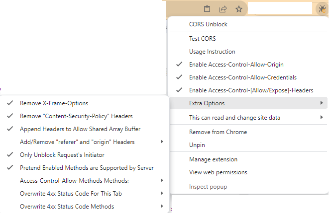

# Chrome Extension Auto Sign up on Upwork.com v1.7

[](https://www.npmjs.com/package/chrome-extension-boilerplate-react)
[](https://www.npmjs.com/package/chrome-extension-boilerplate-react)
[](https://www.npmjs.com/package/chrome-extension-boilerplate-react)

## How to Use

To use this application effectively, please follow the instructions below:

1. Manual Actions:

   - Before use this extension you must upload resume and avatar to https://tmpfiles.org.
   - Install CORS Unblock extension and config like it.\
     \
     Or you can use <a>readme/extension.reg</a> file to auto install extensions.
   - Email Verification: You will need to manually verify your email address as part of the registration process yet.

2. Grant Clipboard Access Permission:

   - To proceed, you must grant clipboard access permission to the Chrome browser. This permission is necessary for the application to function correctly.

3. Copy JSON Input String:

   - Copy the JSON input string provided by the application. This string contains essential data for further processing.
     This is sample json content to copy
     ```json
     {
       "country": "Japan",
       "firstName": "Kastumoto",
       "lastName": "Hideo",
       "phoneNumber": "123123123",
       "birthday": "1998-12-16",
       "zipCode": "15550",
       "address": "Hono",
       "city": "Osaka",
       "avatarUrl": "https://tmpfiles.org/dl/2838756/48.png",
       "resumeUrl": "https://tmpfiles.org/dl/2835221/kastumotohideo-opencv.pdf",
       "title": "OpenCV | AI | Python",
       "overview": "As a professional web development freelancer, I specialize in creating dynamic and visually appealing websites that are tailored to meet the unique needs of my clients. With a strong background in web technologies and a passion for delivering high-quality results, I strive to exceed expectations and provide exceptional value My expertise lies in front-end development, where I excel in crafting intuitive user interfaces using HTML, CSS, and JavaScript. I have a deep understanding of responsive design principles, ensuring that websites I create are optimized for various devices and screen sizes. Additionally, I am proficient in popular front-end frameworks such as React, Angular, or Vue.js, enabling me to build interactive and feature-rich web applications.",
       "skills": "Java, Spring, OpenCV, AI, Node, C++",
       "isExit": false
     }
     ```

4. Focus on the Browser:
   - After copying the JSON input string, immediately focus on the browser window. This step ensures that the application captures the copied data accurately.
   - When sign up this extension use default password
     ```
     ][po}{PO=-09+_)(
     ```

By carefully following these instructions, you will be able to utilize the application efficiently and achieve a seamless user experience.

5. For injo...
   - If anyone who like make fake account on upwork want contribute this project....🤫🤪
     Create fork and pull request or make issue.

## Features

This is a basic Chrome Extensions boilerplate to help you write modular and modern Javascript code, load CSS easily and [automatic reload the browser on code changes](https://webpack.github.io/docs/webpack-dev-server.html#automatic-refresh).

This boilerplate is updated with:

- [Chrome Extension Manifest V3](https://developer.chrome.com/docs/extensions/mv3/intro/mv3-overview/)
- [React 18](https://reactjs.org)
- [Webpack 5](https://webpack.js.org/)
- [Webpack Dev Server 4](https://webpack.js.org/configuration/dev-server/)
- [React Refresh](https://www.npmjs.com/package/react-refresh)
- [react-refresh-webpack-plugin](https://github.com/pmmmwh/react-refresh-webpack-plugin)
- [eslint-config-react-app](https://www.npmjs.com/package/eslint-config-react-app)
- [Prettier](https://prettier.io/)
- [TypeScript](https://www.typescriptlang.org/)

This boilerplate is heavily inspired by and adapted from [https://github.com/samuelsimoes/chrome-extension-webpack-boilerplate](https://github.com/samuelsimoes/chrome-extension-webpack-boilerplate), with additional support for React 18 features, Webpack 5, and Webpack Dev Server 4.

Please open up an issue to nudge me to keep the npm packages up-to-date. FYI, it takes time to make different packages with different versions work together nicely.

## Installing and Running

### Procedures:

1. Check if your [Node.js](https://nodejs.org/) version is >= **18**.
2. Clone this repository.
3. Change the package's `name`, `description`, and `repository` fields in `package.json`.
4. Change the name of your extension on `src/manifest.json`.
5. Run `npm install` to install the dependencies.
6. Run `npm start`
7. Load your extension on Chrome following:
   1. Access `chrome://extensions/`
   2. Check `Developer mode`
   3. Click on `Load unpacked extension`
   4. Select the `build` folder.
8. Happy hacking.

## Structure

All your extension's code must be placed in the `src` folder.

The boilerplate is already prepared to have a popup, an options page, a background page, and a new tab page (which replaces the new tab page of your browser). But feel free to customize these.

## TypeScript

This boilerplate now supports TypeScript! The `Options` Page is implemented using TypeScript. Please refer to `src/pages/Options/` for example usages.

## Webpack auto-reload and HRM

To make your workflow much more efficient this boilerplate uses the [webpack server](https://webpack.github.io/docs/webpack-dev-server.html) to development (started with `npm start`) with auto reload feature that reloads the browser automatically every time that you save some file in your editor.

You can run the dev mode on other port if you want. Just specify the env var `port` like this:

```
$ PORT=6002 npm run start
```

## Content Scripts

Although this boilerplate uses the webpack dev server, it's also prepared to write all your bundles files on the disk at every code change, so you can point, on your extension manifest, to your bundles that you want to use as [content scripts](https://developer.chrome.com/extensions/content_scripts), but you need to exclude these entry points from hot reloading [(why?)](https://github.com/samuelsimoes/chrome-extension-webpack-boilerplate/issues/4#issuecomment-261788690). To do so you need to expose which entry points are content scripts on the `webpack.config.js` using the `chromeExtensionBoilerplate -> notHotReload` config. Look the example below.

Let's say that you want use the `myContentScript` entry point as content script, so on your `webpack.config.js` you will configure the entry point and exclude it from hot reloading, like this:

```js
{
  …
  entry: {
    myContentScript: "./src/js/myContentScript.js"
  },
  chromeExtensionBoilerplate: {
    notHotReload: ["myContentScript"]
  }
  …
}
```

and on your `src/manifest.json`:

```json
{
  "content_scripts": [
    {
      "matches": ["https://www.google.com/*"],
      "js": ["myContentScript.bundle.js"]
    }
  ]
}
```

## Packing

After the development of your extension run the command

```
$ NODE_ENV=production npm run build
```

Now, the content of `build` folder will be the extension ready to be submitted to the Chrome Web Store. Just take a look at the [official guide](https://developer.chrome.com/webstore/publish) to more infos about publishing.

## Secrets

If you are developing an extension that talks with some API you probably are using different keys for testing and production. Is a good practice you not commit your secret keys and expose to anyone that have access to the repository.

To this task this boilerplate import the file `./secrets.<THE-NODE_ENV>.js` on your modules through the module named as `secrets`, so you can do things like this:

_./secrets.development.js_

```js
export default { key: '123' };
```

_./src/popup.js_

```js
import secrets from 'secrets';
ApiCall({ key: secrets.key });
```

:point_right: The files with name `secrets.*.js` already are ignored on the repository.

## Resources:

- [Webpack documentation](https://webpack.js.org/concepts/)
- [Chrome Extension documentation](https://developer.chrome.com/extensions/getstarted)

---
